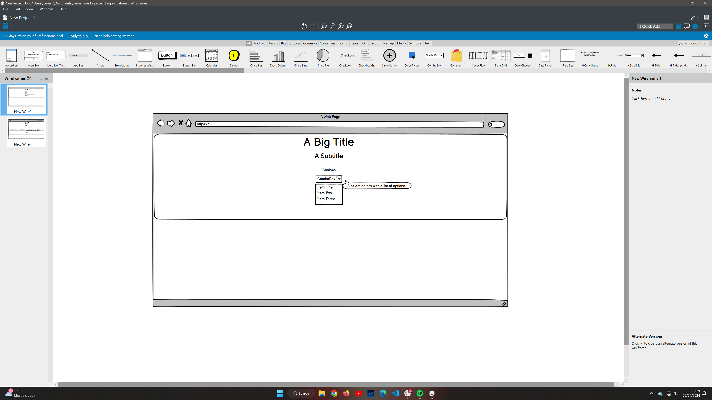
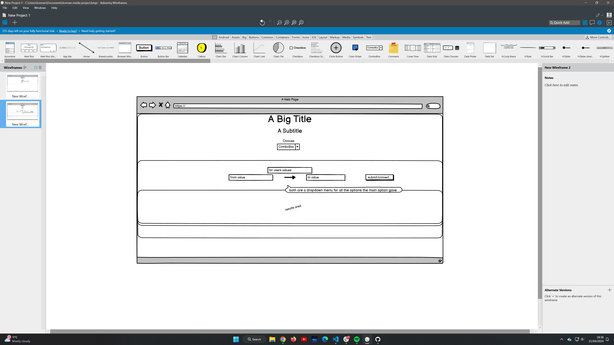

mockup image...

# Simple Unit Converter

This simple unit converter would be a useful tool to all who will need it. It is smart yet funny and stylish to be a bit more fun to use than just a regular unit converter can be found on the web.

Try it yourself here: link...

## User stories
|Story No.|Story|
| ----------- | ----------- |
|1.| As a user,   I want to do some daily tasks around my house that requires to work with measurements that I don't know.    I know I did a good job, when somebody with the same problem, look up the web and finds my Simple Unit Converter. And be able to convert the right measurement unit. |
|2.| As a user,   When I came to the UK i have seen measurements I haven't seen before.    I know I am done when I put all measurement in the converter that can be found all around the world (metric, imperial, etc.).|
|3.| As a user,   I find most of these unit converters boring.    Even though, this is a functional tool, I know i did a good job when somebody smiles when uses my converter and see the funny comments.|
|4.| As a user,   I am a bit like a fish, attracted to the shiny object. Well in this case a stylish object.    I know I did a good job when my converter is a bit stylish, so better for the eye, better for the mood in this gray world. |

***

## Wireframes
Below are the design that were used to start building the site.

| Landing page |
| ------- |
|  |

| Opened option |
| ------- |
|  |

***